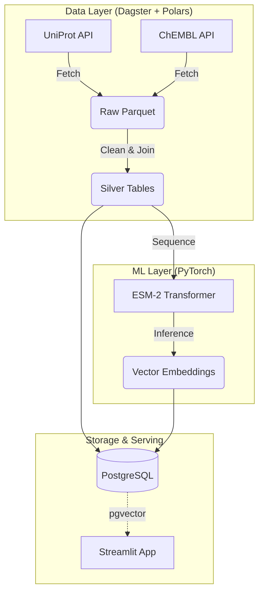

# OpenTargetGraph: AI-Driven Drug Discovery Platform

[](https://dagster.io/)
[](https://pola.rs/)
[](https://pytorch.org/)
[](https://kubernetes.io/)

**OpenTargetGraph** is a cloud-native, end-to-end bioinformatics platform designed to identify and visualize potential drug targets using state-of-the-art Protein Language Models (PLMs). 

It demonstrates a modern **TechBio stack**, combining robust data engineering (Polars/Parquet), scalable orchestration (Dagster), and AI-driven structural biology (ESM-2 Embeddings) to bridge the gap between raw genomic data and actionable therapeutic insights.

## 🚀 High-Level Overview

This platform answers the question: *Which drug targets are structurally similar to known kinase inhibitors, based on deep learning embeddings rather than just sequence alignment?*
- Investigated targets: Known kinase inhibitors from UniProt.
- Investigated drugs: Bioactive molecules from ChEMBL.

1.  **Data Ingestion**: Automates the retrieval of high-value drug targets (e.g., Kinases) from **UniProt** and bioactive small molecules from **ChEMBL**.
2.  **AI Analysis**: Generates high-dimensional vector embeddings for protein sequences using Meta AI's **ESM-2 (Evolutionary Scale Modeling)** transformer.
3.  **Knowledge Graph**: Links targets to drugs in a relational schema, enabling complex queries about bioactivity and mechanism of action.
4.  **Visualization**: A **Streamlit** dashboard that offers:
    * 3D Protein Structure rendering (via Py3Dmol).
    * "Embedding Space" UMAP projection to find novel clusters of similar targets.
    * Semantic search for drug candidates.

📦 Project Structure
--------------------

```
├── open_target_graph/
│   ├── assets/             # Dagster Software-Defined Assets
│   │   ├── ingestion/      # ETL logic for UniProt/ChEMBL
│   │   └── modeling/       # PyTorch inference logic
│   └── dashboard/          # Streamlit frontend application
├── infra/                  # Pulumi IaC definitions
├── data/                   # Local storage for Parquet files (gitignored)
└── Dockerfile              # Multi-stage build for the platform
```

## 🏗️ Architecture

The system follows a microservice-inspired architecture, orchestrated by Dagster and deployed on Kubernetes.



# Developer documentation

## 🛠️ Local Setup (Current Status)

This section describes how to run the project in its current state, which consists of a local Dagster pipeline and a Streamlit dashboard.

### Prerequisites

*   Python 3.9+
*   [uv](https://github.com/astral-sh/uv): A fast Python package installer and resolver, used for environment management.

### 0. Hugging Face Authentication (Optional but Recommended)

The modeling pipeline downloads the `facebook/esm2...` model from the Hugging Face Hub. To avoid rate limits and enable faster downloads, you should use an access token.

1.  Create a free account on HuggingFace.co.
2.  Go to your **Access Tokens** and create a new token with `read` permissions.
3.  Create a `.env` file in the root of the project.
4.  Add your token to the `.env` file. Dagster will automatically load this for you.
    ```
    HF_TOKEN=hf_xxxxxxxxxxxxxxxxxxxxxxxxxxxx
    ```
5.  Ensure `.env` is added to your `.gitignore` file to avoid committing secrets.

### 1. Installation

Clone the repository and create a virtual environment using `uv`.

```bash
uv venv
uv pip install -e ".[dev]"
```

### 2. Run the Data Pipeline (Dagster)

The project uses Dagster to orchestrate data fetching and ML model inference. Run the following command to launch the Dagster UI:

```bash
uv run dagster dev
```

This will start the Dagster UI, typically at http://localhost:3000

Navigate to the Dagster UI in your browser. Find and materialize the assets (`uniprot_parquet` and `protein_embeddings`). This will execute the pipeline, download the data from UniProt, generate embeddings, and save the results into the `data/` directory.

### 3. Run the Dashboard (Streamlit)

Once the data assets from the pipeline exist in the `data/` folder, you can launch the interactive Streamlit dashboard.

```bash
uv run streamlit run open_target_graph/dashboard/app.py
```

The application will now be running and accessible, typically at `http://localhost:8501`.

## Testing

```bash
uv run pytest
```