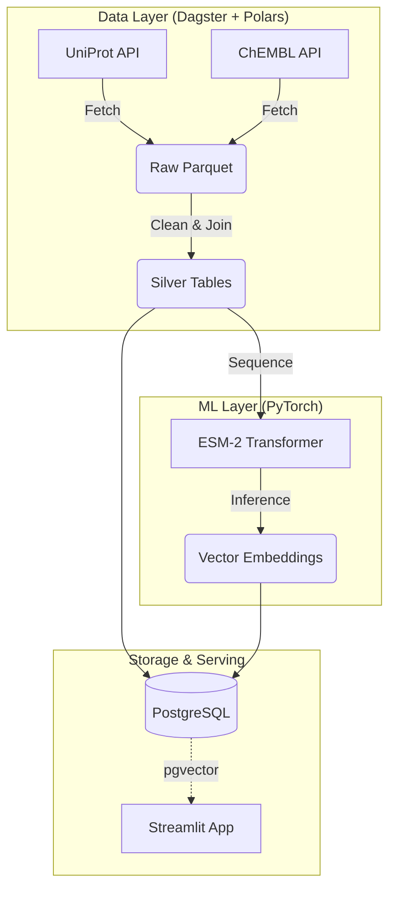

# OpenTargetGraph: AI-Driven Drug Discovery Platform

[](https://dagster.io/)
[](https://pola.rs/)
[](https://pytorch.org/)
[](https://kubernetes.io/)

**OpenTargetGraph** is a cloud-native, end-to-end bioinformatics platform designed to identify and visualize potential drug targets using state-of-the-art Protein Language Models (PLMs). 

It demonstrates a modern **TechBio stack**, combining robust data engineering (Polars/Parquet), scalable orchestration (Dagster), and AI-driven structural biology (ESM-2 Embeddings) to bridge the gap between raw genomic data and actionable therapeutic insights.

## 🚀 High-Level Overview

This platform answers the question: *Which drug targets are structurally similar to known kinase inhibitors, based on deep learning embeddings rather than just sequence alignment?*

1.  **Data Ingestion**: Automates the retrieval of high-value drug targets (e.g., Kinases) from **UniProt** and bioactive small molecules from **ChEMBL**.
2.  **AI Analysis**: Generates high-dimensional vector embeddings for protein sequences using Meta AI's **ESM-2 (Evolutionary Scale Modeling)** transformer.
3.  **Knowledge Graph**: Links targets to drugs in a relational schema, enabling complex queries about bioactivity and mechanism of action.
4.  **Visualization**: A **Streamlit** dashboard that offers:
    * 3D Protein Structure rendering (via Py3Dmol).
    * "Embedding Space" UMAP projection to find novel clusters of similar targets.
    * Semantic search for drug candidates.

📦 Project Structure
--------------------

```
├── assets/             # Dagster Software-Defined Assets
│   ├── ingestion/      # ETL logic for UniProt/ChEMBL
│   └── modeling/       # PyTorch inference logic
├── dashboard/          # Streamlit frontend application
├── infra/              # Pulumi IaC definitions
├── data/               # Local storage for Parquet files (gitignored)
└── Dockerfile          # Multi-stage build for the platform
```

## 🏗️ Architecture

The system follows a microservice-inspired architecture, orchestrated by Dagster and deployed on Kubernetes.

