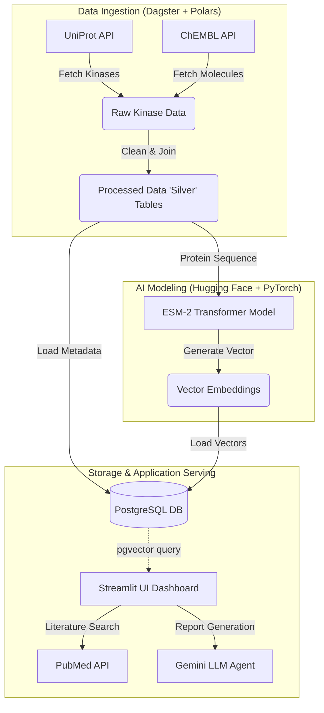

# OpenTargetGraph: AI-Driven Drug Discovery Platform

[](https://dagster.io/)
[](https://pola.rs/)
[](https://pytorch.org/)
[](https://postgresql.org/)
[](https://www.docker.com/)
[](https://kubernetes.io/)
[](https://www.pulumi.com/)

**OpenTargetGraph** is an end-to-end bioinformatics platform designed to identify and visualise potential drug targets using state-of-the-art Protein Language Models (PLMs). 

It demonstrates a modern **TechBio stack**, combining robust data engineering (Polars/Parquet), scalable orchestration (Dagster), and AI-driven structural biology (ESM-2 Embeddings) to bridge the gap between raw biological data and therapeutic insights.

> A note on the name: The "Graph" in "OpenTargetGraph" is a bit of a misnomer. No graph database or knowledge graph is used in this project.

## 🚀 Overview

This platform provides suggestions for drugs that could inhibit kinase protein targets, based on the  structural similarity of those targets to with other kinases the drugs are known to inhibit. A literature search can be conducted to provide additional evidence for the potential of the suggested drugs.

The application includes the following components:
1.  **Data Ingestion**: Automates the retrieval of high-value drug targets (e.g., Kinases) from **UniProt** and bioactive small molecules from **ChEMBL**.
2.  **AI Analysis**: Generates high-dimensional vector embeddings for protein sequences using Meta AI's **ESM-2 (Evolutionary Scale Modeling)** transformer.
3.  **Vector Search & Relational Storage**: Stores target metadata and drug activity in a PostgreSQL database, and stores ESM-2 embeddings using pgvector. This enables semantic similarity searches to group related protein targets and infer target-drug associations based on structural proximity.
4.  **Visualisation**: A **Streamlit** dashboard that offers:
    *   3D Protein Structure rendering (via Py3Dmol).
    *   An "Embedding Space" t-SNE projection to visualise clusters of similar targets.
    *   **Semantic search for drug candidates** based on protein similarity.
    *   **Autonomous Research Assistant**: Deep-dive literature analysis via PubMed and LLM-driven research reports.

📦 Project Structure
--------------------

```
├── open_target_graph/
│   ├── assets/             # Dagster Software-Defined Assets
│   │   ├── db/             # Loads data into PostgreSQL using pgvector
│   │   ├── ingestion/      # ETL logic for UniProt/ChEMBL
│   │   └── modeling/       # Hugging Face Transformers & PyTorch inference logic for ESM-2 embeddings
│   ├── agents/             # Agentic logic
│   │   ├── researcher.py   # The Pydantic output schema and LLM system prompt
│   │   └── workflow.py     # The LangGraph state machine
│   └── dashboard/          # Streamlit frontend application
├── data/                   # Local storage for Parquet files (gitignored)
├── docker-compose.yml      # Docker Compose file for local development
├── Dockerfile.dagster      # Dockerfile for Dagster
├── Dockerfile.streamlit    # Dockerfile for Streamlit
└── pyproject.toml          # Python package and dependency management
```

## 🏗️ Architecture



# Developer documentation

### (Optional) Hugging Face Authentication 

The modeling pipeline downloads the `facebook/esm2...` model from the Hugging Face Hub. To avoid rate limits and enable faster downloads, you should use an access token.

1.  Create a free account on HuggingFace.co.
2.  Go to your **Access Tokens** and create a new token with `read` permissions.
3.  Create a `.env` file in the root of the project.
4.  Add your token to the `.env` file. Dagster will automatically load this for you.
    ```
    HF_TOKEN=hf_xxxxxxxxxxxxxxxxxxxxxxxxxxxx
    ```
5.  Ensure `.env` is added to your `.gitignore` file to avoid committing secrets.

### (Optional) Gemini API Key

The dashboard uses the Gemini API for the research assistant. To use this feature, you need a Gemini API key.

1.  Create a free account on [Google AI Studio](https://aistudio.google.com/).
2.  Go to **Get API Key** and create a new API key.
3.  Add your API key to the `.env` file.
    ```
    GEMINI_API_KEY=your_gemini_api_key
    ```
4.  Ensure `.env` is added to your `.gitignore` file to avoid committing secrets.

## 🛠️ Local Setup

<details>

<summary>Local Setup</summary>


### Prerequisites

*   Python 3.9+
*   [uv](https://github.com/astral-sh/uv): A fast Python package installer and resolver, used for environment management.

### 1. Installation

Clone the repository and create a virtual environment using `uv`.

```bash
git clone https://github.com/edwardchalstrey/open_target_graph.git
cd open_target_graph
uv venv
uv pip install -e ".[dev]"
```

To update the dependencies:

```bash
uv sync
```

### 2. Run the Data Pipeline (Dagster)

The project uses Dagster to orchestrate data fetching and ML model inference. Run the following command to launch the Dagster UI:

```bash
uv run dagster dev
```

This will start the Dagster UI, typically at http://localhost:3000

Navigate to the Dagster UI in your browser and click on **Lineages**. To configure the number of kinases fetched:
1. Select the `raw_uniprot_kinases` asset.
2. Click the dropdown arrow next to **Materialize all** and select **Launchpad**.
3. In the configuration editor, specify the `num_kinases`.
4. Click **Materialize selected** to materialize the first asset.
5. Click off the `raw_uniprot_kinases` asset and click the dropdown arrow again and choose **Materialize unsynced** to materialize the remaining assets.

Alternatively, you can simply click **Materialize all** to use the default of 100. This will execute the pipeline, download the data from UniProt and ChEMBL, generate embeddings, and load the results into the PostgreSQL database.

*Note: For the local setup, the `load_to_postgres` asset requires a PostgreSQL database to be running locally.*

### 3. Setup PostgreSQL Locally

The platform requires a PostgreSQL database with the `pgvector` extension to store and query the generated embeddings.

TODO: Add instructions for setting up PostgreSQL locally (this has only been tested in Docker).

Ensure this database is running before executing the data pipeline or launching the dashboard.

### 4. Run the Dashboard (Streamlit)

Once the data assets from the pipeline have been materialized and loaded into the PostgreSQL database, you can launch the interactive Streamlit dashboard.

```bash
uv run streamlit run open_target_graph/dashboard/app.py
```

The application will now be running and accessible  at http://localhost:8501.

### Testing

See manual setup above.

```bash
uv run pytest
```

</details>

## 🐳 Docker Setup

To run the entire application stack including Dagster, PostgreSQL (with `pgvector`), and the Streamlit dashboard all at once:

1. Ensure [Docker](https://www.docker.com/) is installed and running.
2. Clone the repository:
    ```bash
    git clone https://github.com/edwardchalstrey/open_target_graph.git
    cd open_target_graph
    ```
3. Run the following command from the project root. By default, this will pull pre-built images from Docker Hub. To build locally, use the `--build` flag:
   ```bash
   docker compose up -d
   ```

### Materialize the data assets in Dagster

Navigate to the Dagster UI in your browser and click on **Lineages**. To configure the number of kinases fetched:
1. Select the `raw_uniprot_kinases` asset.
2. Click the dropdown arrow next to **Materialize all** and select **Launchpad**.
3. In the configuration editor, specify the `num_kinases`.
4. Click **Materialize selected** to materialize the first asset.
5. Click off the `raw_uniprot_kinases` asset and click the dropdown arrow again and choose **Materialize unsynced** to materialize the remaining assets.

Alternatively, you can simply click **Materialize all** to use the default of 100. This will execute the pipeline, download the data from UniProt and ChEMBL, generate embeddings, and load the results into the PostgreSQL database.

Wait for the data ingestion to finish, then open the Streamlit GUI at http://localhost:8501.

To stop the application, run the following command:

```bash
docker compose down
```

### Testing

To run the tests in the Docker container:

```bash
docker compose exec dagster uv run pytest
```

## ☸️ Kubernetes Setup (Local with Kind)

For production-like local testing, you can deploy the stack to a Kubernetes cluster using [Pulumi](https://www.pulumi.com/).

We'll use Docker images that are already built and available on Docker Hub.
- `edchalstrey/open_target_graph-dagster:latest`
- `edchalstrey/open_target_graph-streamlit:latest`

### Prerequisites

*   [Kind](https://kind.sigs.k8s.io/) installed.
*   [Pulumi CLI](https://www.pulumi.com/docs/get-started/install/) installed.
*   [kubectl](https://kubernetes.io/docs/tasks/tools/) installed.

### 1. Create a Local Cluster

```bash
kind create cluster --name open-target-graph
```

### 2. Deploy with Pulumi

Initialize the environment and deploy:

```bash
cd infra
uv venv
source .venv/bin/activate
uv pip install -r requirements.txt

# Create a secret for development (replace with your key)
kubectl create secret generic api-secrets --from-literal=GEMINI_API_KEY=your_actual_key_here

pulumi up
```

### 3. Access the Services

Use port-forwarding to access the UI:

```bash
# Dagster UI
kubectl port-forward svc/dagster 3000:3000

# Streamlit Dashboard
kubectl port-forward svc/streamlit 8501:8501
```
